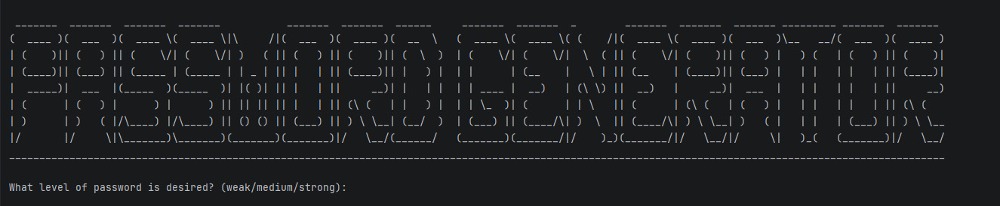

# 🔐 Password Generator

<p align="center">
  <b>A simple and fast password generator developed in Python.</b>
</p>

<p align="center">
  
  
  
</p>
<p align="center">
  
</p>

---

## Overview

**Password Generator** is a password generator developed in **Python**.

It allows you to easily generate a random password without having to come up with a sufficiently complex combination of characters yourself to meet the requirements of a website or application.

The program offers **3 security levels**:

| Level      | Description                           |
| ---------- | ------------------------------------- |
| **Low**    | Password with reduced complexity      |
| **Medium** | Password with intermediate complexity |
| **Strong** | Password with high complexity         |

---

## Requirements

Before getting started, make sure you have:

* **Python 3**
* **Git**

Check your Python installation:

```bash
python3 --version
```

You can also check whether Git is installed:

```bash
git --version
```

---

## Installation

### 1. Clone the repository

Open a terminal and run:

```bash
git clone https://github.com/Creed-31/Password-generator.git
```

### 2. Enter the project directory

```bash
cd Password-generator
```

The project is now installed on your machine.

---

## How to run it

Run the program with Python 3:

```bash
python3 main.py
```

---

## Contributing

Contributions are welcome!

If you would like to improve the project:

1. Fork the repository.
2. Create a new branch.
3. Make your changes.
4. Commit your changes.
5. Open a Pull Request.

---

## License

This project is distributed under the **MIT License**.

See the [`LICENSE`](LICENSE) file for the complete license terms.

---

## Author

Creed-31
